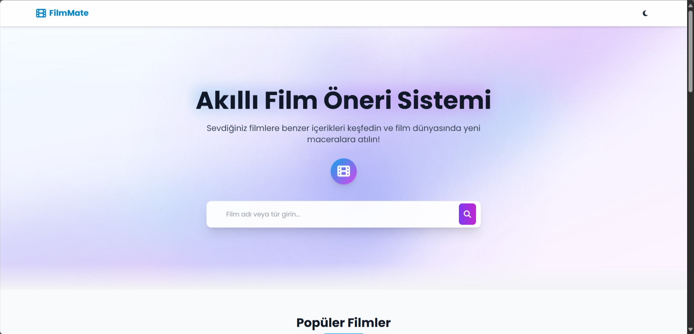
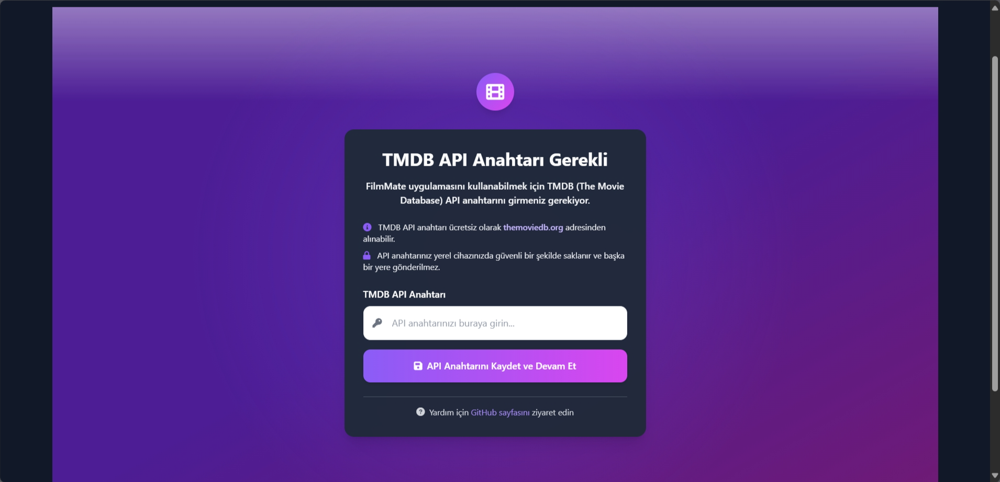
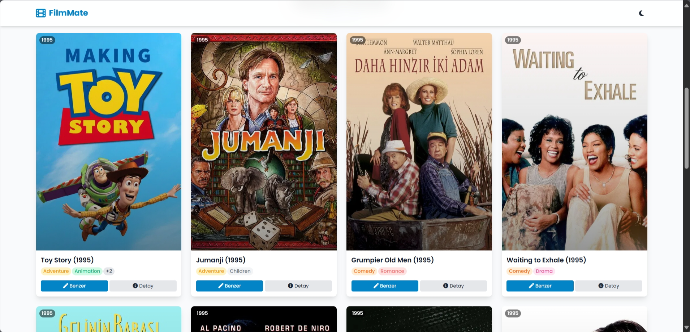
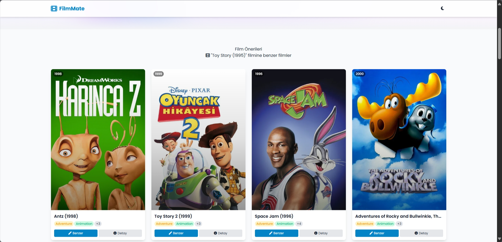

<div align="center">

#  FilmMate - Akıllı Film Öneri Sistemi


## Canlı Demo
Uygulamanın canlı versiyonunu görmek için: [FilmMate AI Demo](https://filmmate-ai.onrender.com)


</div>

<div align="center">

</div>

FilmMate, yapay zeka ve tür benzerliği algoritmaları kullanarak kullanıcılara özel film önerileri sunan modern bir web uygulamasıdır. TMDB API entegrasyonu ile güncel film bilgileri, posterler ve detayları sunar, kullanıcı dostu arayüzü ve sürükleyici deneyimiyle film keşfetmeyi keyifli hale getirir.

## ✨ Özellikler

- **İleri Film Önerme Algoritması:** Tür benzerliği ve yapay zeka tabanlı film önerileri
- **Akıllı Arama:** Hızlı ve etkili film arama özelliği
- **Film Detayları:** Her film için detaylı bilgiler (açıklamalar, puan, yıl)
- **Benzer Film Önerileri:** Seçilen filme benzer türdeki filmler
- **Film Posterleri:** TMDB API entegrasyonu ile yüksek kaliteli posterler
- **Modern Arayüz:** TailwindCSS ile responsive, modern ve kullanıcı dostu tasarım
- **Koyu/Açık Mod:** Göz yorgunluğunu azaltan tema seçenekleri
- **Güvenli API Yönetimi:** Kullanıcı dostu TMDB API anahtarı yönetim sistemi

## Kurulum

### 1. Repoyu Klonlayın

```bash
git clone https://github.com/karamanhakan66/FilmMate-AI-Movie-Recommender.git
cd FilmMate-AI-Movie-Recommender
```

### 2. Sanal Ortamı Oluşturun

```bash
python -m venv venv

# Windows için:
venv\Scripts\activate

# Linux/Mac için:
source venv/bin/activate
```

### 3. Bağımlılıkları Yükleyin

```bash
pip install -r requirements.txt
```

### 4. TMDB API Anahtarını Alın

- [TMDB Sitesine](https://www.themoviedb.org/) üye olun
- [API Ayarları](https://www.themoviedb.org/settings/api) sayfasından ücretsiz bir API anahtarı alın
- Uygulamayı çalıştırdığınızda otomatik olarak bir API anahtarı giriş sayfası açılacaktır

<div align="center">

</div>

### 5. Uygulamayı Çalıştırın

```bash
python app.py
```

### 6. Tarayıcıda Görüntüleyin

Tarayıcınızda `http://localhost:5000` adresini açın ve uygulamayı kullanmaya başlayın!

<div align="center">

</div>

## Kullanım

### Ana Sayfa
Popüler filmler karşılama ekranında listelenir. Arama kutusunu kullanarak istediğiniz filmi bulabilirsiniz.

### Film Arama
Arama kutusu, siz yazdıkça sonuçları gerçek zamanlı olarak gösterir. Arama sonuçlarından bir film seçin.

<div align="center">

</div>

### Film Detayları
Seçilen filmin detayları ve benzer film önerileri görüntülenir.

<div align="center">

</div>

### Benzer Filmler
Bir filmin detay sayfasında, benzer türde filmler yapay zeka algoritması ile otomatik olarak listelenir.

<div align="center">

</div>

## 💻 Teknolojiler

<div align="center">
<table>
  <tr>
    <td align="center" width="96">
      
      <br>Python
    </td>
    <td align="center" width="96">
      
      <br>JavaScript
    </td>
    <td align="center" width="96">
      
      <br>Flask
    </td>
    <td align="center" width="96">
      
      <br>scikit-learn
    </td>
    <td align="center" width="96">
      
      <br>pandas
    </td>
    <td align="center" width="96">
      
      <br>TMDB API
    </td>
  </tr>
  <tr>
    <td align="center" width="96">
      
      <br>TailwindCSS
    </td>
    <td align="center" width="96">
      
      <br>jQuery
    </td>
    <td align="center" width="96">
      
      <br>Font Awesome
    </td>
    <td align="center" width="96">
      
      <br>NumPy
    </td>
    <td align="center" width="96">
      
      <br>Git
    </td>
    <td align="center" width="96">
      
      <br>HTML/CSS
    </td>
  </tr>
</table>
</div>

### API Entegrasyonu
FilmMate, TMDB (The Movie Database) API kullanarak güncel film bilgilerine ve posterlere erişir. API anahtarı yönetim sistemi sayesinde kullanıcılar kendi API anahtarlarını güvenli bir şekilde ekleyip kullanabilirler.

## 🚀 Gelecek Özellikler

- [ ] Kullanıcı oturum açma ve kayıt sistemi
- [ ] Kişiselleştirilmiş film önerileri
- [ ] Favori film listesi oluşturma
- [ ] Film inceleme ve puanlama sistemi
- [ ] Daha gelişmiş yapay zeka algoritması
- [ ] Çoklu dil desteği

## 💪 Katkıda Bulunma

1. Bu repoyu fork edin
2. Yeni bir branch oluşturun (`git checkout -b feature/amazing-feature`)
3. Değişikliklerinizi commit edin (`git commit -m 'Add some amazing feature'`)
4. Branch'inizi push edin (`git push origin feature/amazing-feature`)
5. Bir Pull Request oluşturun

## 🔐 Güvenlik

- TMDB API anahtarları, `config.py` dosyasında saklanır ve bu dosya `.gitignore` ile git takibinden çıkarılmıştır.
- API anahtarları yerel olarak saklanır ve hiçbir harici kaynağa gönderilmez.
- Kullanıcı oturumlarında güvenli bir şekilde saklanır.

## 📜 Lisans

Bu proje MIT lisansı altında lisanslanmıştır. Daha fazla bilgi için `LICENSE` dosyasına bakın.

## 📞 İletişim

<div align="center">

[](https://github.com/karamanhakan66)

</div>

### Bağlantılar

- Proje: [https://github.com/karamanhakan66/FilmMate-AI-Movie-Recommender](https://github.com/karamanhakan66/FilmMate-AI-Movie-Recommender)
- TMDB API: [https://www.themoviedb.org/documentation/api](https://www.themoviedb.org/documentation/api)
